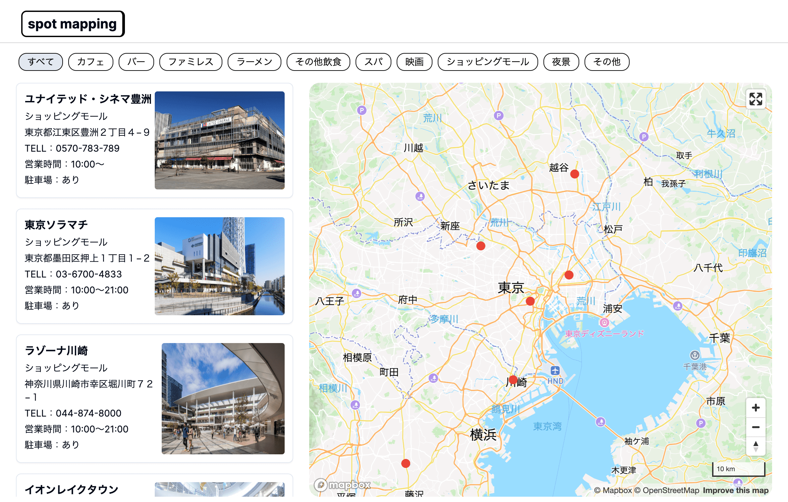
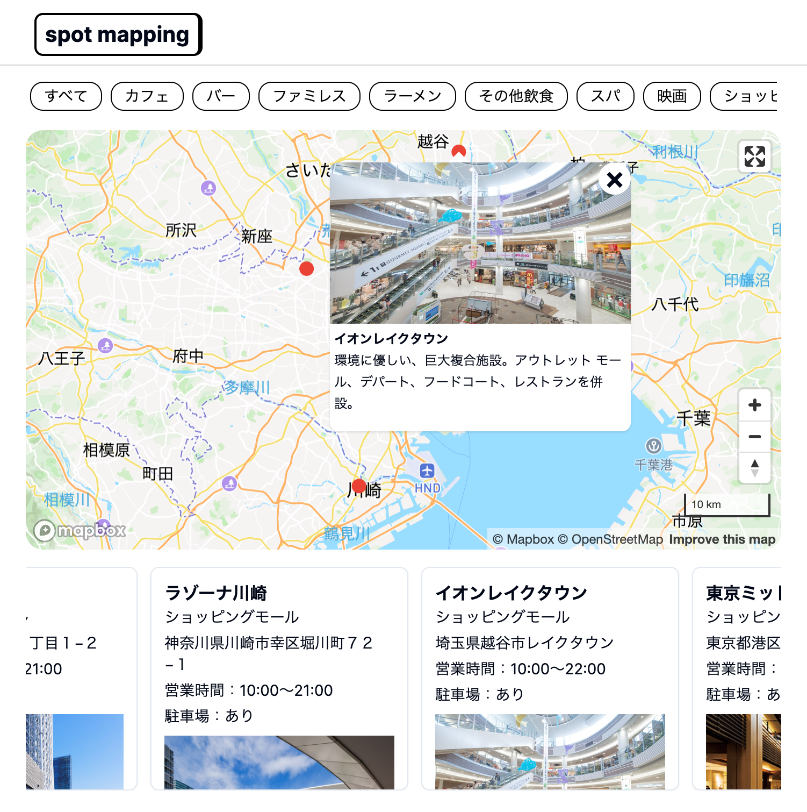

## <u>spot-mapping-app</u>

##### <概要>

お気に入りのスポットを地図上に表示するサイトです。
Googleマップのようなサイトを作ってみたいと思い作成しました。
マップの表示にはコストの観点からMapboxを採用しました。
URL: https://spot-mapping-app.vercel.app/

##### <製作日>

2023年12月（制作期間：約2週間）

##### <仕様>

サイトの仕組みは以下の流れになっています。

- 上部のカテゴリータブを選択する。
- ページ左側にスポット一覧が表示される。
- スポット一覧から任意のスポットを選択すると、地図上にポップアップが表示される。
（地図上のマーカーを選択してもポップアップは表示されます）

<mapAPIの選択について>
MapboxかGoogleマップの選択肢がありましたが、アクセス数の増加で料金が発生することのないMapboxにしました。

<Mapboxライブラリの選択について>
選択肢としてreact-mapbox-glとmapbox-glがありました。
reactの方が扱いやすいだろうとreact-mapbox-glを選択しましたが、情報が少なく扱いづらかったので途中でmapbox-glに切り替えました。ライブラリの事前選定の大事さが身にしみました。

##### <使用技術>

Next.js13(app router), recoil, tailwind, shadcn, typescript, etc

##### <参考URL>

<Mapbox初期表示>

- [Use Mapbox GL JS in a React app(Mapbox Tutrial)](https://docs.mapbox.com/help/tutorials/use-mapbox-gl-js-with-react/)
- [【React/mapboxの地図上で3D モデルを動かす】(2) mapboxの地図上に3Dモデルを表示する](https://qiita.com/itouoti/items/90550c8d529d63596d96)

<Mapbox(フルスクリーン、スケール、ナビゲーションControl、日本語化の追加)>

- [Markers and controls](https://docs.mapbox.com/mapbox-gl-js/api/markers/)
- [mapbox-gl-language](https://github.com/mapbox/mapbox-gl-language)

<Popupの表示>

- [Display a popup on click](https://docs.mapbox.com/mapbox-gl-js/example/popup-on-click/)
- [Display a popup on hover](https://docs.mapbox.com/mapbox-gl-js/example/popup-on-hover/)
- [can't access 'coordinates' member of geojson feature collection](https://stackoverflow.com/questions/55621480/cant-access-coordinates-member-of-geojson-feature-collection)